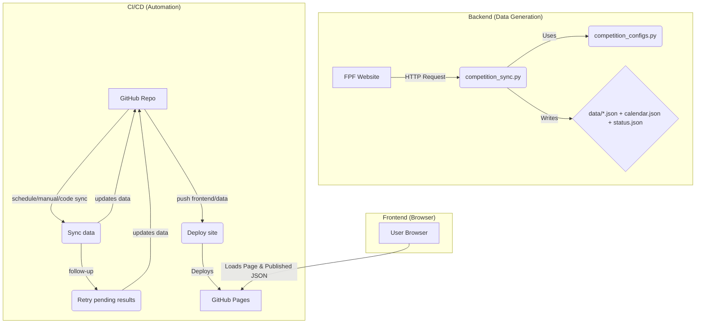

# Arquitetura do Projeto

## Visão Geral

O microsite é constituído por páginas estáticas HTML, uma folha de estilos comum e JavaScript sem build step (`main.js` e `agenda.js`). As páginas consomem ficheiros JSON gerados previamente por um motor Python comum que extrai informação do portal de resultados da Federação Portuguesa de Futebol (FPF). O resultado é um site sem dependências de build, facilmente servível por qualquer CDN ou pelo GitHub Pages.

## Frontend

- Cada página de competição (`seniores.html`, `juniores.html`, etc.) declara em `data-competition` a chave que identifica o ficheiro JSON correspondente (`data/{chave}.json`).
- `main.js` é carregado nas páginas de competição e divide-se em dois blocos: `ThemeManager`, responsável por sincronizar o tema claro/escuro com `localStorage` e com a preferência do sistema operativo, e o motor da competição, que lê os dados publicados, gere o estado da jornada ativa e renderiza resultados e classificação.
- `agenda.js` é dedicado à página [agenda.html](/Users/mariocabano/Documents/GitHub/scores_CFA/agenda.html), lendo `data/calendar.json` e `data/crests.json` para construir a Agenda/Resultados globais.
- Durante o carregamento (`DOMContentLoaded`), o frontend obtém os JSON publicados no Pages, inicializa o estado com a jornada recomendada publicada no próprio JSON (`defaultRoundIndex`) e ativa a navegação por hash (`#resultados-jX`, `#classificacao-jX`) quando aplicável.
- A renderização é agora `published-first`: a app usa o JSON publicado como fonte autoritativa e só cai em `localStorage` quando o fetch desse JSON falha.
- O frontend prefere agora a metadata publicada pelo pipeline (`defaultRoundIndex`, `defaultRoundNumber`, `lastUpdatedAt`, `sourceHealth`) e usa o cálculo local baseado em datas apenas como fallback. Isto reduz diferenças entre desktop/mobile e entre sessões com `hash` antigo.
- A renderização é responsiva: o layout alterna automaticamente entre versões mobile e desktop. O cabeçalho de detalhe utiliza **CSS Grid** para garantir o centramento matemático do título e acomodar subtítulos de várias linhas (fases/séries) sem sobreposição, substituindo o anterior posicionamento absoluto. O destaque visual à equipa CF Os Armacenenses é aplicado via CSS e os emblemas são recuperados de `crests.json`.
- Na Agenda, o seletor de período foi simplificado para um picker centrado por calendário, sem atalhos rápidos adicionais. Os cards de jogo usam badges de competição com cor sólida coerente com a palete do índice e mantêm um layout específico por breakpoint.

## Dados e Armazenamento

- `data/{competicao}.json` contém metadata de sincronização e um array `rounds`. A estrutura publicada é:
  - `defaultRoundIndex`
  - `defaultRoundNumber`
  - `lastUpdatedAt`
  - `sourceHealth`
  - `rounds[]`
- `data/calendar.json` agrega os jogos normalizados de todas as competições para suportar a Agenda/Resultados globais.
- `data/status.json` agrega o estado de qualidade e atualização de todas as competições.
- Cada entrada de `rounds` segue a estrutura `{ index, fixtureId, matches[], classification[] }`. Cada jogo guarda equipas, data, hora, estádio e resultado; a classificação inclui métricas agregadas (jogos, vitórias, golos, pontos).
- As classificações locais foram corrigidas para incluir sempre todas as equipas (o parser já não depende do surgimento do bloco `#matches` no HTML da FPF). Isto evita “listas cortadas” em dispositivos que ficam apenas com os dados empacotados.
- Em competições sem classificação remota fiável, a tabela é derivada localmente a partir dos resultados (`3/1/0`) durante a sincronização.
- `data/crests.json` é um mapa de nomes normalizados de clubes para caminhos relativos de imagem (`img/crests/*.png`). O frontend normaliza os nomes (remoção de acentos, pontuação e duplicação de espaços) antes de procurar neste mapa.
- A pasta `cache/` guarda HTML bruto das jornadas descarregado pelos scrapers Python. Pode ser reutilizado em execuções futuras ativando a flag `USE_CACHE` para reduzir chamadas à FPF durante o desenvolvimento.
- Os assets visuais vivem em `img/` (logótipo principal) e `img/crests/` (emblemas). A folha de estilos comum (`css/style.css`) aplica identidade consistente a todas as páginas.

## Scrapers e Geração de Conteúdo

- O código de sincronização está centralizado em [competition_sync.py](/Users/mariocabano/Documents/GitHub/scores_CFA/competition_sync.py). Este motor:
  - descarrega a página da competição;
  - localiza fase/série;
  - obtém os `fixtureId`;
  - descarrega os fragmentos por jornada;
  - faz parsing de jogos e classificação;
  - reutiliza jornadas existentes quando a origem falha;
  - publica metadata adicional no JSON.
- A configuração por competição está centralizada em [competition_configs.py](/Users/mariocabano/Documents/GitHub/scores_CFA/competition_configs.py). Os ficheiros `fetch_<competicao>.py` são agora wrappers mínimos sobre essa configuração, mantidos por compatibilidade com a automação e com o fluxo atual de desenvolvimento.
- Todos os scrapers partilham o mesmo padrão de regex para a classificação, com lookahead que aceita o fim da secção. Esta alteração elimina perdas da última linha quando a FPF altera ligeiramente a marcação, garantindo JSON consistente entre competições.
- O cliente HTTP comum está em [fpf_http.py](/Users/mariocabano/Documents/GitHub/scores_CFA/fpf_http.py). Ele concentra sessão persistente, headers, retries, deteção de bloqueios e reaproveitamento de contexto HTTP, reduzindo `403` intermitentes da FPF.
- Algumas competições podem definir fallback secundário apenas para score. O caso atualmente ativo é `juniores`, onde o Zerozero é usado apenas para preencher resultados em falta, mantendo a FPF como fonte de jornadas, calendário e estrutura.
- `generate_crest_manifest.py` percorre `img/crests/`, normaliza os nomes de ficheiros (retirando acentos e símbolos) e cria o manifesto `data/crests.json`, adicionando aliases para variações comuns dos nomes.
- `tools/probe_fixture.py` é um utilitário rápido para descarregar o HTML de um `fixtureId` específico, gravando a resposta em `cache/fixture_<id>.html` para apoiar a criação ou debugging dos scrapers.

## Automação e Deploy

- O workflow [/.github/workflows/update-data.yml](/Users/mariocabano/Documents/GitHub/scores_CFA/.github/workflows/update-data.yml) (`Sync data`) é o coração da sincronização: corre manualmente, por schedule e em alterações relevantes de código de sync, instala dependências, corre testes unitários, executa uma primeira vaga leve dos fetchers selecionados, regenera agregados e faz commit automático das alterações em `data/`.
- O workflow [/.github/workflows/retry-pending-results.yml](/Users/mariocabano/Documents/GitHub/scores_CFA/.github/workflows/retry-pending-results.yml) faz o follow-up de resultados pendentes. Reavalia o plano e só corre novos fetches quando o planner indicar que a próxima janela útil chegou (`nextRecommendedFetchAt`).
- O workflow [/.github/workflows/deploy-app.yml](/Users/mariocabano/Documents/GitHub/scores_CFA/.github/workflows/deploy-app.yml) (`Deploy site`) publica frontend e JSON já gerados. Isto garante que commits manuais em `data/*.json` também chegam ao Pages.
- [run_fetchers.py](/Users/mariocabano/Documents/GitHub/scores_CFA/run_fetchers.py) adiciona:
  - retries por fetcher;
  - backup e restauro do JSON anterior;
  - validação estrutural do output;
  - deteção de estado `DEGRADED` quando houve reaproveitamento de jornadas antigas;
  - overrides por workflow para tornar a vaga inicial leve e deixar a insistência para o follow-up.
- [plan_fetchers.py](/Users/mariocabano/Documents/GitHub/scores_CFA/plan_fetchers.py) já aplica a lógica adaptativa principal:
  - `awaiting_window`
  - `result_chase`
  - `recent_historical_backfill`
  - `historical_backfill`
  - `missing_payload`
- O follow-up já respeita as janelas:
  - primeiro fetch útil em `kickoff + 2h`
  - retries curtos em `15 minutos`
  - recuperação recente em `2h`
  - recuperação histórica em `6h`
- Os testes unitários e os testes de regressão usam snapshots reais em [tests/fixtures/fpf](/Users/mariocabano/Documents/GitHub/scores_CFA/tests/fixtures/fpf), o que ajuda a apanhar mudanças do HTML da FPF antes de afetarem o deploy.
- Após os dados serem atualizados, o site é publicado usando GitHub Pages (`actions/deploy-pages`). Como não existem etapas de build, o artefacto enviado corresponde à árvore de ficheiros do repositório.

## Próxima Fase Recomendada

A arquitetura atual já separa bem frontend, JSON publicados, workflows e geração agregada. O problema principal da fase seguinte já não é estrutural: é observabilidade, granularidade e deteção real de mudanças.

O plano principal para essa evolução está em:

- [SCRAPING_RELIABILITY_EXECUTION_PLAN.md](/Users/mariocabano/Documents/GitHub/scores_CFA/SCRAPING_RELIABILITY_EXECUTION_PLAN.md)

Esse plano passa a ser a referência principal para:

- `FetchResult` estruturado;
- `fetch_state.json`;
- relatório por fixture;
- separação real entre `calendar_watch` e `result_chase`;
- workflow gates críticos antes de commit/deploy;
- uniformização do schema publicado.

## Fluxo de Desenvolvimento

- Para adicionar uma nova competição, crie a respetiva página HTML (copiando um template existente), defina a chave `data-competition`, adicione uma entrada em [competition_configs.py](/Users/mariocabano/Documents/GitHub/scores_CFA/competition_configs.py), crie um wrapper `fetch_<competicao>.py` mínimo e execute-o para gerar `data/<competicao>.json`.
- Ao introduzir novos emblemas, coloque o ficheiro PNG em `img/crests/` seguindo a nomenclatura "Equipa.png", depois execute `python generate_crest_manifest.py` para atualizar o manifesto.
- Qualquer alteração estruturante no JSON ou na renderização deve ser refletida em testes unitários/regressão, em validação manual local e, quando aplicável, documentada no `README.md` e no `ROADMAP.md`.
