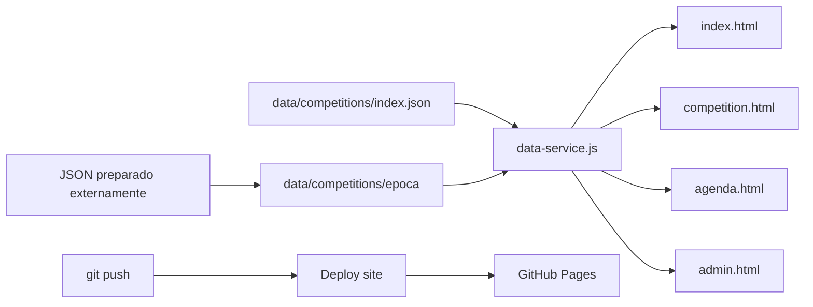

# Arquitetura

## Visão Geral

A aplicação é totalmente estática e não contém código de scraping. O repositório recebe ficheiros JSON produzidos externamente, publica-os no GitHub Pages e normaliza-os no browser.

```mermaid
graph LR
    A[JSON preparado externamente] --> B[data/competitions/epoca]
    C[data/competitions/index.json] --> D[data-service.js]
    B --> D
    D --> E[index.html]
    D --> F[competition.html]
    D --> G[agenda.html]
    D --> H[admin.html]
    I[git push] --> J[Deploy site]
    J --> K[GitHub Pages]
```

## Catálogo

`data/competitions/index.json` é a fonte autoritativa para determinar:

- competições visíveis;
- ficheiro associado;
- época, título e subtítulo;
- nomes que identificam a equipa do clube;
- cor visual de cada competição.

Adicionar um JSON à pasta sem o registar no catálogo não o torna visível. Remover ou desativar uma entrada retira-a da app sem alterar o frontend.

## Serviço De Dados

`data-service.js` concentra a camada de dados:

1. carrega e valida o catálogo;
2. carrega cada JSON sem cache HTTP persistente;
3. rejeita ficheiros sem `rounds` ou explicitamente incompletos;
4. converte `snake_case` do ficheiro para o modelo usado pela interface;
5. normaliza nomes e identifica as equipas do clube;
6. escolhe a jornada inicial mais relevante;
7. agrega os jogos do clube para a Agenda.

Não existem `calendar.json` nem `status.json`. Esses modelos são calculados em memória e evitam ficheiros derivados que possam ficar dessincronizados.

## Frontend

- `index.html` e `main.js` constroem a lista a partir do catálogo.
- `competition.html?key=<chave>` é o único template de competição.
- `agenda.html` e `agenda.js` agregam apenas jogos das equipas declaradas em `teamNames`.
- `admin.html` e `admin.js` mostram integridade, data de captura e contagens por ficheiro.
- `data/crests.json` resolve emblemas por nome normalizado, com fallback local.

## Publicação

O único workflow é `.github/workflows/deploy-app.yml`. Qualquer `push` em `main` que altere HTML, JavaScript, CSS, imagens ou `data/**` publica o conteúdo estático no GitHub Pages.

O deploy não lê fontes externas, não altera JSON e não cria commits.

## Nova Época

1. Criar `data/competitions/<nova-epoca>/`.
2. Colocar os JSON dessa época.
3. Atualizar `activeSeason` e as entradas em `data/competitions/index.json`.
4. Validar localmente e publicar.

As competições podem mudar entre épocas; não existe dependência de uma lista histórica fixa.
